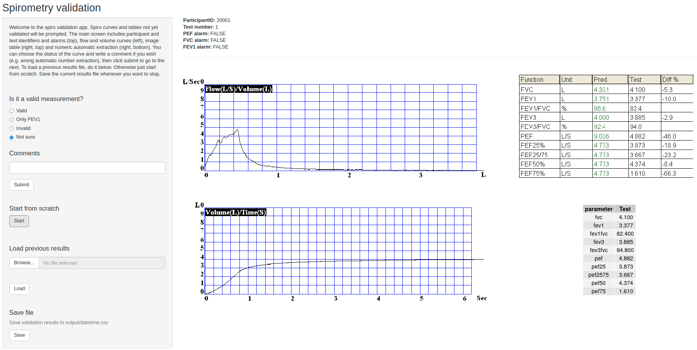

# Spirometry data cleaning in the CHAI project

This repository contains the code to clean spirometry data used in the paper entitled *Association of Ambient and Household Air Pollution with Lung Function in Young Adults in an Peri-Urban Area of South-India: a cross-sectional study* by [Ranzani et al.](https://www.sciencedirect.com/science/article/pii/S0160412022002173) within the [CHAI project](https://www.isglobal.org/en/-/chai-cardiovascular-health-effects-of-air-pollution-in-andhra-pradesh-india). Spirometry data included in the project comprises index children measurements in the [APCAPS](https://apcaps.lshtm.ac.uk/) cohort follow-up 3.

The spirometry software used to collect the data was Spiro Pro Card Guard (Card Guard) and the data obtained was challenging to compile because outputs were only available in image format (one table of measurements plus two curves, flow and volume). This repository contains the preprocessing steps we undertook to clean it, which involved 1) automatic digit extraction from the output table, and 2) expert inspection of the data and quality assessment.

Code was written in R version 4.0.5 and used packages include `magick`, `gridExtra`, `tesseract`, `tidyverse`, `shiny`, `shinyalert`, and `cowplot`.

## Workflow of the project

1. [ReadImages](1.ReadImages/): This R project contains the preprocessing steps prior to data inspections. The steps to perform are as follows:

    1. Copy the spirometry image files into the [input](1.ReadImages/input/) folder. A sample of 4 anonymous participants has been already placed there for illustrative purposes.
    2. Open the ReadImages R project.
    3. Run the file [retrieve_paths.R](1.ReadImages/code/retrieve_paths.R), which creates the string paths to the spirometry images to be used. 
    4. Run the file [read_tables.R](1.ReadImages/code/read_tables.R), which uses Optical Character Recognition (OCR) algorithms defined in this [code](1.ReadImages/code/utils.R) to extract the information from the spirometry tables. Invalid characters in the tables have been set to value 9999 in the final data, they mostly contained dollar signs. Empty cells have been coded as NAs. Note that the code included in this step is tailored to the outputs of this specific version of the software, so a different software or version may require adaptation of this code.
    5. Run the file [generate_alarms.R](1.ReadImages/code/generate_alarms.R), which generates a series of flags with the extracted spirometry tabular data for later use in the data inspection. For more information on those, please check the script. 
  
  
2. [ValidationApp](2.ValidationApp/): This shiny app helps to assess the validity of the spirometries. The steps to make it work are as follows:

    1. Copy the [three output files](1.ReadImages/output) from stage 1 and paste them to [inputs in stage 2](2.ValidationApp/input).
    2. Open the ValidationApp R project and launch the app via the GUI or `shiny::runApp()`. It should look like this:
    
    3. Follow the instructions in the app to perform the spirometry validation.
    
    
3. [OrderingApp](3.OrderingApp/): This shiny app helps to order the spirometries of each participant by quality of the measurements. The steps to make it work are as follows:

    1. Copy the [three output files](1.ReadImages/output) from stage 1 and paste them as [inputs in stage 3](3.OrderingApp/input). Additionaly, copy the final output file from step 2, rename it as `validation.csv`, and put it in the input folder as well.
    2. Open the OrderingApp R project and launch the app via the GUI or `shiny::runApp()`. It should look like this:
    
    3. Follow the instructions in the app to perform the spirometry ordering.
